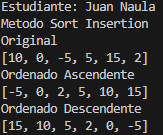
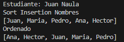
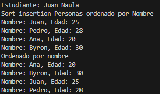
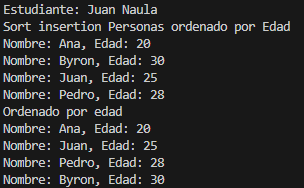

# Estructura de datos

**Estudiante:** Juan Naula

## Metodos Ordenamiento

### Practica 1 - 20/Oct
Metodo Sort Bubble

### Practica 2 - 21/Oct
Metodo Sort Selecction en Java y Python

Salida de Python

Salida de Java

### Practica 3 - 23/Oct
Metodo Sort Insertion en java

Arreglo Numeros Enteros

Arreglo de Cadenas (nombres)

Arreglo de personas ordenado por Nombre

Arreglo de personas ordenado por Edad

